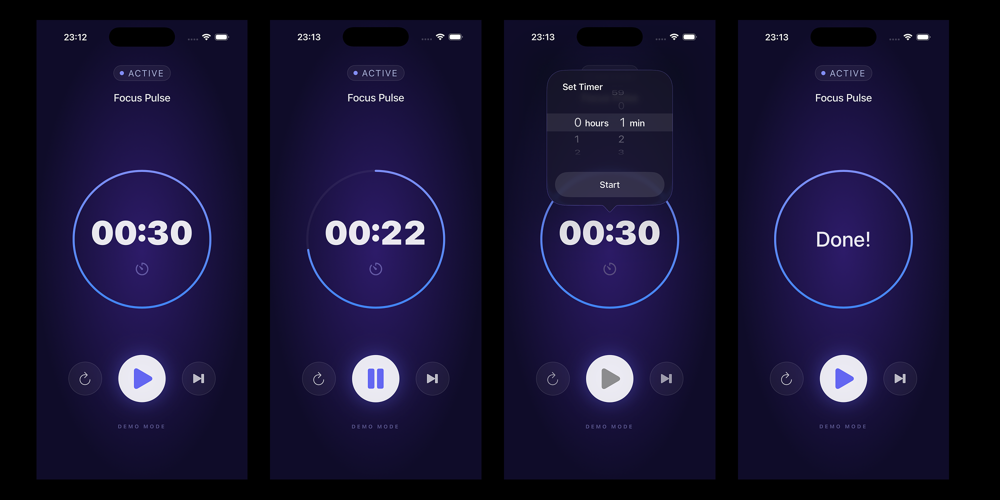

# CountdownTimer



A high-precision, modern countdown timer built for iOS.

## Features

- **Precision Engine**: Powered by **Combine** and `Date`-based calculations to ensure zero drift and absolute accuracy.
- **Reactive UI**: The visual progress ring and timer text are perfectly synchronized using reactive streams.
- **Modern Glow Zen Design**: Reimagined with a deep radial gradient background, vibrant glassmorphism controls, and detailed glow effects.
- **Background Support**: (Pending)

## ⚡️ The Precision Engine

Most timer apps simply subtract `1` every second (`time -= 1`). This is naive; if the CPU is busy or the app lags, "1 second" might take `1.05` seconds. Over a 20-minute session, this drift adds up, making the timer inaccurate.

**CountdownTimer is different.**

It calculates the exact **Target End Date** (`Date + Duration`) the moment you press start. On every frame, it recalculates `Remaining = Target - Now`.

-   **Zero Drift**: Even if the app hangs for 5 seconds, it wakes up with the *correct* remaining time.
-   **Self-Correcting**: It mathematically guarantees the timer ends exactly when it should.

## Tech Stack

- **Language**: **Swift 6** (Strict Concurrency Checked)
- **Platform**: **iOS 26.0+**
- **Architecture**: **MVVM** (Model-View-ViewModel)
- **UI Framework**: **UIKit** (Programmatic, No Storyboards)
- **Data Flow**: **Combine**

## Architecture

This project demonstrates a professional, scalable architecture for UIKit apps:

- **Programmatic UI**: Complete removal of Storyboards for cleaner, reviewable, and conflict-free UI code.
- **Component-Based**: UI is composed of isolated, reusable components (`HeaderView`, `ControlsView`, `ProgressBar`).
- **Structured Organization**: Clean separation of concerns with dedicated `Models`, `ViewModels`, `Components`, and `Resources` directories.
- **Isolation**: Strict adherence to `MainActor` isolation and Sendable types where required.

## Installation

1. Clone the repository.
   ```bash
   git clone https://github.com/devbyjonni/CountdownTimer.git
   ```
2. Open `CountdownTimer.xcodeproj` in Xcode 16 or later.
3. Build and run on any iOS 26+ simulator or device.

## License

Copyright © 2026 Jonni Akesson. All rights reserved.
